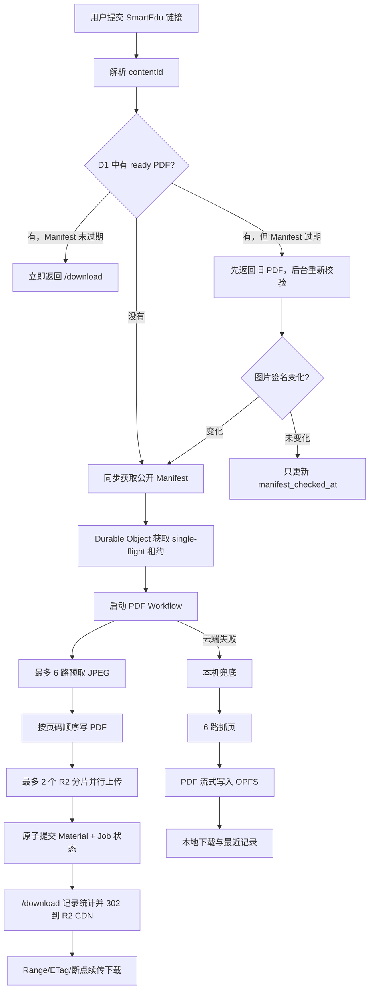

# PDF 教材获取、生成与下载性能改造实施方案

状态：待实施  
适用项目：织册  
形成日期：2026-07-16

本文是一份可以直接按顺序实施的完整方案。范围锁定为：云端冷生成加速、热缓存直达、断点续传下载、本机低内存兜底、完整测试与生产发布。暂不访问智慧教育平台的源 PDF，也不引入全量教材爬取和“边生成边下载”这类高复杂度能力。

## 一、完成标准

全部步骤执行后，系统需要达到：

- 205 页教材冷生成 P50 ≤ 30 秒、P95 ≤ 60 秒。
- 已缓存教材提交后 1 秒内返回下载入口。
- PDF 下载支持 `HEAD`、`Range`、`206`、`ETag` 和断点续传。
- 同一本教材同时提交 10 次，只启动一个 Workflow。
- 云端峰值工作内存控制在约 40 MiB 内，低于 Workers 128 MiB 限制。
- 本机生成不再把完整 PDF 同时保存在 ArrayBuffer、Blob 和 IndexedDB。
- 云端失败后仍能使用本机生成。
- 旧 R2 PDF 不失效，可以逐步迁移。
- 所有单元、Worker、浏览器、E2E 和生产验证通过。
- 不读取或代理 `source` PDF，不携带用户 Cookie，不改变当前合规边界。

## 二、最终架构



Cloudflare 当前限制每次 Worker 调用最多 6 个同时等待响应头的外连，因此抓页和 R2 上传要共享一个容量为 6 的信号量，而不是盲目叠加 6+2 个连接。[Workers limits](https://developers.cloudflare.com/workers/platform/limits/)

## 三、预先准备的外部信息

实施前确定以下值：

| 名称                        | 示例                           | 用途               |
| --------------------------- | ------------------------------ | ------------------ |
| `<APP_DOMAIN>`              | `zhice.example.com`            | 当前应用域名       |
| `<DOWNLOAD_DOMAIN>`         | `download.example.com`         | 生产 R2 自定义域名 |
| `<DOWNLOAD_STAGING_DOMAIN>` | `download-staging.example.com` | 预发布下载域名     |
| `<CLOUDFLARE_ZONE_ID>`      | Cloudflare Zone ID             | CDN URL 清缓存     |
| `<STAGING_D1_ID>`           | 新建后获得                     | 预发布数据库       |
| `<STAGING_BUCKET>`          | `zhice-staging`                | 预发布 R2          |

确认当前 `zhice` R2 Bucket 只保存公开预览页重新生成的 PDF。当前代码只在这里保存 `materials/**.pdf`，可以连接公开自定义域名；如果 Bucket 里已有任何非公开对象，必须先创建单独的 `zhice-public-pdf` Bucket，不能直接公开现有 Bucket。

R2 自定义域名可以使用 Cloudflare Cache；`r2.dev` 不适合生产。[R2 public buckets](https://developers.cloudflare.com/r2/buckets/public-buckets/)

## 四、逐步实施计划

以下命令全部通过 Nushell 执行，例如：

```bash
nu -lc 'pnpm check'
```

### 第 1 步：建立分支和性能基线

执行：

```bash
nu -lc 'git switch -c codex/pdf-pipeline-v2'
nu -lc 'pnpm install'
nu -lc 'pnpm check'
nu -lc 'pnpm test'
nu -lc 'pnpm test:worker'
nu -lc 'pnpm test:browser'
```

新增：

```text
scripts/benchmark-pdf-pipeline.ts
```

脚本需要支持：

- `ZHICE_SAMPLE_URL`
- `ZHICE_BENCH_CONCURRENCY`
- `ZHICE_BENCH_FULL=1`
- 测量 Manifest 时间。
- 用 `Range: bytes=0-0` 统计每页大小。
- 默认只对前 24 页比较 1 并发和 6 并发。
- `FULL=1` 时完整获取 205 页。
- 输出 JSON：页数、总字节、墙钟时间、累计请求时间、最大单页、失败页、重试数。

不要把完整样例 PDF 或页面图片写入仓库。

完成条件：

- 当前串行基线被保存到 `docs/operations.md`。
- 基准脚本运行失败不会修改 D1/R2。
- 所有原有测试仍通过。

建议提交：

```text
test: add PDF pipeline benchmark
```

### 第 2 步：增加预发布环境

新增：

```text
wrangler.staging.jsonc
```

创建独立资源：

```bash
nu -lc 'wrangler d1 create zhice-staging'
nu -lc 'wrangler r2 bucket create zhice-staging'
```

预发布配置需要使用：

- Worker：`zhice-staging`
- D1：`zhice-staging`
- R2：`zhice-staging`
- Workflow：`zhice-pdf-workflow-staging`
- Durable Object 仍为 `MaterialCoordinator`
- `ENVIRONMENT=staging`
- 预发布下载域名
- 与生产不同的 `OPS_TOKEN`、`RATE_LIMIT_PEPPER`

不要让预发布绑定生产 D1 或生产 R2。

更新：

- `package.json`
- `.env.example`
- `docs/deployment.md`

增加脚本：

```json
{
  "deploy:staging": "pnpm build && wrangler deploy --config wrangler.staging.jsonc",
  "db:migrate:staging": "wrangler d1 migrations apply ZHICE_DB --remote --config wrangler.staging.jsonc",
  "verify:staging": "tsx scripts/verify-production.ts"
}
```

完成条件：

- 预发布 Worker 能访问独立 D1、R2、Workflow 和 DO。
- `/api/health` 返回 `staging`。
- 预发布无法看到生产任务和 PDF。

建议提交：

```text
chore: add isolated staging environment
```

### 第 3 步：增加数据库字段和运行配置

修改：

- `packages/db/src/schema.ts`
- `apps/worker/src/env.ts`
- `wrangler.jsonc`
- `wrangler.staging.jsonc`

给 `materials` 增加：

```sql
manifest_checked_at INTEGER
pdf_etag TEXT
pdf_version TEXT
```

给 `jobs` 增加：

```sql
generator_version TEXT NOT NULL DEFAULT 'v1'
```

增加索引：

```sql
CREATE INDEX materials_ready_checked_idx
ON materials(status, manifest_checked_at);
```

生成迁移：

```bash
nu -lc 'pnpm db:generate'
```

预期生成类似：

```text
packages/db/migrations/0001_pdf_pipeline_v2.sql
```

运行变量：

```jsonc
{
  "PDF_PUBLIC_BASE_URL": "https://download.example.com",
  "PDF_FETCH_CONCURRENCY": 6,
  "PDF_UPLOAD_CONCURRENCY": 2,
  "PDF_PART_SIZE_BYTES": 8388608,
  "MATERIAL_MANIFEST_TTL_MS": 86400000,
  "PDF_GENERATOR_VERSION": "v2",
}
```

新增：

```text
apps/worker/src/config.ts
```

它负责：

- 读取和校验配置。
- 抓页并发限定为 `1..6`。
- 上传并发限定为 `1..2`。
- 分片大小最低 5 MiB，默认 8 MiB。
- Manifest TTL 默认 24 小时。
- 公共下载地址必须是 HTTPS。
- 配置非法时使用安全默认值，并输出一次结构化警告。

迁移必须是纯增加字段，不能删除或重建旧表。

完成条件：

- 旧数据迁移后仍存在。
- 旧材料的新增字段为 `NULL`。
- 新任务默认记录 `generator_version=v2`。
- 本地和 staging migration 都能成功运行。

建议提交：

```text
db: add PDF cache version metadata
```

### 第 4 步：建立稳定、不可变的 PDF 版本键

新增：

```text
packages/core/src/pdf/version.ts
```

实现：

```text
canonical = imageSignature + "|" + generatorVersion
pdfVersion = SHA-256(canonical) 的小写十六进制
r2Key = materials/<contentId>/<pdfVersion>.pdf
```

不要继续把完整 `imageBasePath` 写进 R2 Key。

更新：

- `packages/core/src/pdf/index.ts`
- `packages/core/src/index.ts`

测试：

- 相同签名和生成器版本得到相同 Key。
- 图片路径或页数变化时 Key 变化。
- 生成器从 v2 升级到 v3 时 Key 变化。
- Key 只包含 UUID、十六进制和 `/`，不能包含 `..`、冒号或反斜杠。

完成条件：

- 新生成 PDF 使用短的内容寻址 URL。
- 旧 R2 Key 仍能通过数据库读取。

建议提交：

```text
feat: add immutable PDF artifact versioning
```

### 第 5 步：实现可重试的有界并发抓页器

重构：

```text
apps/worker/src/services/images.ts
```

新增：

```text
apps/worker/src/services/concurrency.ts
```

实现两个组件。

#### 5.1 共享响应头信号量

`HeaderSemaphore(6)`：

- 发起 `fetch()` 前获取槽位。
- `fetch()` 返回 Response，也就是响应头到达后立即释放槽位。
- `arrayBuffer()` 在释放后读取。
- R2 `uploadPart()` 无法提前得到响应头，因此占用槽位直到 Promise 完成。

#### 5.2 按序消费的预取窗口

接口建议：

```ts
prefetchPagesInOrder(manifest, {
  concurrency,
  signal,
  onPageFetched,
});
```

行为：

- 同时最多保留 6 个页面 Promise。
- 页面可以乱序下载，但只按 `1..pageCount` 交给 PdfWriter。
- 最多缓存 6 个 `Uint8Array`。
- 任一页最终失败时取消其余未完成请求。
- Reset、新任务或浏览器取消时调用 AbortController。

单页获取规则：

- 首选 `(page - 1) % 3 + 1` 对应源站。
- 每个镜像最多尝试一次。
- 单次超时 15 秒。
- 网络错误、408、429、5xx 可以换镜像。
- 401、403 为不可重试错误。
- 404 可以尝试下一镜像；三个镜像均 404 后失败。
- 校验 HTTP 状态、`Content-Type`、JPEG SOI 和 `parseJpegSize()`。
- 错误需要携带页码、镜像、HTTP 状态和错误代码，但用户消息不暴露源站路径。

新增测试：

```text
test/unit/page-prefetch.test.ts
```

覆盖：

- 并发从不超过 6。
- 页面乱序完成时输出仍严格有序。
- 第一页很慢时最多只缓存 6 页。
- 单镜像失败后切换镜像。
- 403 不进行无意义重试。
- Abort 后所有请求停止。
- JPEG 非法时报告正确页码。

完成条件：

- 205 页输出顺序稳定。
- 抓页阶段实际并发不超过配置。
- 失败不会留下继续运行的 Promise。

建议提交：

```text
perf: fetch textbook pages with bounded concurrency
```

### 第 6 步：让 R2 分片上传并行且保持内存上限

重构：

- `apps/worker/src/services/r2-multipart-sink.ts`
- `test/unit/r2-multipart-sink.test.ts`

`R2MultipartPdfSink.create()` 增加：

```ts
{
  partSize: 8 * 1024 * 1024,
  uploadConcurrency: 2,
  semaphore,
  httpMetadata,
  customMetadata,
}
```

创建 multipart 时写入：

```ts
httpMetadata: {
  contentType: "application/pdf",
  contentDisposition: "attachment; filename*=UTF-8''...",
  cacheControl: "public, max-age=31536000, immutable",
}

customMetadata: {
  contentId,
  pdfVersion,
  generatorVersion,
  pageCount,
}
```

并行实现要求：

- 一个当前写入缓冲区。
- 最多两个正在上传的完整分片。
- 达到两个后对 PdfWriter 施加背压。
- 最后一个分片允许小于 5 MiB。
- `complete()` 等待全部上传，按 `partNumber` 排序后完成。
- 任一分片失败后，后续 `write()` 立即失败，等待已启动 Promise 收敛，并调用 `abort()`。
- `abort()` 必须可以重复调用。
- 结果返回 `size`、`etag`、`r2Key`。

预计内存：

- 当前分片 8 MiB。
- 两个上传中分片 16 MiB。
- 6 个页面约 15 MiB 上限。
- 当前页面及 PDF 元数据约数 MiB。
- 总体约 35–45 MiB。

R2 multipart 支持分片并行和失败分片重试，非最后分片必须大小一致且至少 5 MiB。[R2 multipart uploads](https://developers.cloudflare.com/r2/objects/upload-objects/)

测试增加：

- 上传中的 Promise 从不超过 2。
- 非最后分片完全等长。
- `complete()` 会等待慢分片。
- 分片乱序完成时提交顺序正确。
- 某分片失败后执行 abort。
- Metadata 正确传入。
- 总字节数精确。

完成条件：

- 原有 PdfWriter 不需要知道 R2 并发细节。
- 上传失败不会产生可见的半成品对象。
- 所有测试无未处理 Promise rejection。

建议提交：

```text
perf: overlap R2 multipart uploads
```

### 第 7 步：把 D1 状态提交改成原子操作

重构：

```text
apps/worker/src/services/db.ts
```

增加：

```ts
getFreshReadyMaterial();
revalidateMaterial();
completeGeneration();
failGeneration();
invalidateMaterialArtifact();
```

`upsertMaterial()` 必须在图片签名变化时同时清空：

- `pdf_r2_key`
- `pdf_size`
- `pdf_etag`
- `pdf_version`
- `error`

并更新 `manifest_checked_at`。

`completeGeneration()` 使用 `ZHICE_DB.batch()` 原子执行：

1. 条件更新 `materials`：

```sql
WHERE content_id = ?
AND image_signature = ?
```

2. 更新 `jobs` 为 `succeeded`。
3. 写入一次 `cloud_succeeded` 使用事件。

如果第一个更新没有命中，说明生成过程中教材版本发生变化：

- 删除刚生成的 R2 对象。
- Job 标为 `canceled`。
- 不允许旧 Workflow 覆盖新 Manifest。

`failGeneration()` 原子执行：

- material 标为 failed。
- job 标为 fallback_ready。
- 写入 cloud_failed。

`createJob()` 改为返回构造好的 `DbJob`，不要插入后再读取一次。这样减少 D1 请求，也避免读写一致性问题。

完成条件：

- Material ready 与 Job succeeded 不会出现一个成功、一个失败的中间状态。
- 教材版本切换时旧 Workflow 不能覆盖新版本。
- 使用统计每次任务只写一次。

建议提交：

```text
refactor: make PDF job state transitions atomic
```

### 第 8 步：重构 Workflow 为可重试、幂等步骤

重构：

```text
apps/worker/src/workflows/pdf-workflow.ts
```

Workflow 固定拆成：

1. `resolve manifest`
2. `renew single flight`
3. `generate artifact`
4. `commit ready state`
5. `release single flight`

`generate artifact`：

- 先计算确定性 R2 Key。
- 先 `head(r2Key)`。
- 如果对象已存在且 Metadata 匹配 `pdfVersion`，直接复用。
- 否则启动并发抓页和并发 multipart。
- 每 10 页或至少间隔 1 秒更新进度。
- 全部页面写完后将状态改为 uploading。
- 等待剩余 R2 分片。
- 返回小对象 `{r2Key,size,etag,pdfVersion,metrics}`，不能把 PDF 放进 Workflow state。

配置：

```ts
{
  timeout: "20 minutes",
  retries: {
    limit: 2,
    delay: "5 seconds",
    backoff: "exponential",
  },
}
```

幂等要求：

- 同一步重试时已存在完整对象就复用。
- 不完整 multipart 在 catch 中 abort。
- 如果 R2 complete 成功但 Workflow 在返回前中断，重试通过 `head()` 发现对象。
- 所有随机值和时间采集都放在 step 内。
- release 必须也是 Workflow step。

Cloudflare 建议 Workflow 步骤独立可重试、使用确定性名称，并把大文件保存在 R2 而不是 Workflow state。[Rules of Workflows](https://developers.cloudflare.com/workflows/build/rules-of-workflows/)

记录指标：

```text
manifestMs
queueMs
pageFetchWallMs
pageFetchAggregateMs
pdfWriteMs
uploadDrainMs
totalMs
bytes
pages
pageRetries
fetchConcurrency
uploadConcurrency
```

完成条件：

- 任一页临时失败只重试该页。
- Workflow 整体重试时不会产生两个最终对象。
- 成功状态只在 R2 complete 后写入。
- 失败后能够本机兜底。

建议提交：

```text
refactor: make PDF workflow idempotent and retryable
```

### 第 9 步：修复 Single-flight 租约

重构：

- `apps/worker/src/durable/material-coordinator.ts`
- `apps/worker/src/routes/jobs.ts`
- `apps/worker/src/routes/ops.ts`

保留现有 fetch 风格即可，增加三个所有者安全操作：

```text
claim(jobId)
renew(jobId)
release(jobId)
```

规则：

- `claim` 返回 `acquired` 和 `ownerJobId`。
- 租约默认 30 分钟。
- `renew` 只有当前 owner 可以执行。
- `release` 只有当前 owner 可以删除租约。
- 旧 Workflow 不能释放后来创建的新任务。
- 如果 existing job 已是终态，Jobs route 释放旧租约并重试 claim 一次。
- Ops retry 也必须先 claim，不能绕过 single-flight。
- Ops purge 遇到活动任务默认返回 409；需要显式 `force=true` 才能终止或清理。

新增 Worker 测试：

```text
test/worker/material-coordinator.test.ts
```

覆盖：

- 第二个任务得到第一个 jobId。
- 非 owner 无法 renew/release。
- 租约过期后可以重新 claim。
- 旧任务 release 不影响新 owner。
- 同时 10 个 claim 只有一个获胜。

完成条件：

- 同一本教材不会重复生成。
- Retry 和 purge 不破坏锁语义。

建议提交：

```text
fix: make material generation lease owner-safe
```

### 第 10 步：实现热缓存快速路径

修改：

- `apps/worker/src/routes/jobs.ts`
- `apps/worker/src/services/db.ts`

新的 POST 顺序：

1. 限流。
2. 解析 contentId。
3. 查询 D1。
4. 如果 `status=ready`、存在 `pdf_r2_key`，立即创建 succeeded Job 并返回。
5. 如果 `manifest_checked_at` 超过 24 小时，通过 `c.executionCtx.waitUntil()` 后台 revalidate。
6. 热路径不访问智慧教育平台，也不执行 R2 `head()`。
7. 非 ready 才同步获取 Manifest。
8. 获取 single-flight。
9. 启动 Workflow。

后台 revalidate：

- 签名相同：只更新标题、页数和 checked time。
- 签名变化：清空旧 artifact 引用，后续请求生成新版本。
- 上游失败：保留当前 ready PDF，不影响当前用户。
- 输出结构化日志，不把后台错误返回给已经命中缓存的用户。

旧缓存兼容：

- `pdf_version IS NULL` 表示 v1 legacy artifact。
- 它仍然算 ready。
- 它暂时通过 Worker 下载，不直接跳 CDN。
- 新生成的 v2 artifact 才使用 CDN 直达。

测试：

- Fresh ready：0 次上游 fetch、0 次 R2 head。
- Stale ready：立即返回，并安排后台校验。
- 签名变化：旧 R2 引用清空。
- Miss：正常创建 Workflow。
- 同一教材并发提交返回相同活动 job。

完成条件：

- 热缓存路径只有 D1 写读，没有智慧教育平台网络等待。
- 上游短暂不可用不会影响已缓存文件。

建议提交：

```text
perf: return ready PDF before upstream revalidation
```

### 第 11 步：配置 CDN 下载和完整 Range 兜底

#### 11.1 R2 自定义域名

在 Cloudflare Dashboard：

1. 打开 R2 Bucket `zhice`。
2. Settings → Custom Domains。
3. 添加 `<DOWNLOAD_DOMAIN>`。
4. 关闭 `r2.dev` 生产访问。
5. 给 staging Bucket 添加 `<DOWNLOAD_STAGING_DOMAIN>`。

增加 Cache Rule：

```text
Hostname equals <DOWNLOAD_DOMAIN>
AND URI Path starts with /materials/
```

动作：

- Cache eligibility：Eligible for cache。
- Edge TTL：Respect origin Cache-Control。
- Browser TTL：Respect origin。
- Cache Key：完整 URL，不忽略路径。
- 开启 Smart Tiered Cache。

Cloudflare CDN 可以从缓存处理 Range；有 `Content-Length` 时返回 206。[Cloudflare cache Range behavior](https://developers.cloudflare.com/cache/concepts/default-cache-behavior/)

#### 11.2 下载 API 改成统计后重定向

重构：

```text
apps/worker/src/routes/materials.ts
```

对于 v2 artifact：

1. 查询 material。
2. 通过 `c.executionCtx.waitUntil(recordUsage(...))` 异步记录。
3. 返回 `302` 到：

```text
<PDF_PUBLIC_BASE_URL>/<pdf_r2_key>
```

这样保留现有 `/api/materials/:contentId/download` 契约，同时真正的大文件不再穿过 Worker。

#### 11.3 实现 v1 和 CDN 故障兜底

如果 `pdf_version IS NULL`，或 `PDF_PUBLIC_BASE_URL` 未设置：

- 继续从 R2 Worker binding 返回。
- 支持 GET 和 HEAD。
- 将请求 Headers 传给：

```ts
bucket.get(key, {
  range: request.headers,
  onlyIf: request.headers,
});
```

返回：

- `200`：完整文件。
- `206`：Range。
- `304`：条件请求未修改。
- `416`：非法 Range。
- `ETag: object.httpEtag`
- `Accept-Ranges: bytes`
- `Content-Length`
- `Content-Range`
- R2 http metadata。

测试：

```text
test/worker/material-download.test.ts
```

覆盖：

- v2 返回 CDN 302。
- v1 返回 200 body。
- HEAD 无 body。
- `bytes=0-1023` 返回 206。
- suffix range 正确。
- If-None-Match 返回 304。
- 缺失对象返回 404。
- 下载统计不阻塞响应。

完成条件：

- Chrome、Edge、Safari 可以暂停后继续下载。
- 旧 PDF 仍然可用。
- CDN 配置异常时可以通过清空 `PDF_PUBLIC_BASE_URL` 回退 Worker。

建议提交：

```text
feat: serve PDFs through resumable R2 CDN downloads
```

### 第 12 步：本机生成改为有界并发和 OPFS 流式写入

拆分当前过大的 `apps/web/src/client/app.ts`。

新增：

```text
apps/web/src/client/pdf/fetch-pages.ts
apps/web/src/client/pdf/opfs-sink.ts
apps/web/src/client/pdf/local-generator.ts
```

#### 12.1 OPFS sink

`OpfsPdfSink`：

- `navigator.storage.getDirectory()`
- `getFileHandle(<jobId>.pdf, {create:true})`
- `createWritable()`
- 每个 PdfWriter chunk 直接 `write()`。
- 成功后 `close()`。
- 失败后 `abort()` 并删除临时文件。
- 完成后通过 `getFile()` 获得磁盘支持的 File，再创建 object URL 下载。

`createWritable()` 已在新浏览器中达到 Baseline 2025，但保存文件选择器仍不具备全浏览器支持，因此 OPFS 应作为默认流式存储，`showSaveFilePicker()` 只能渐进增强。[MDN createWritable](https://developer.mozilla.org/en-US/docs/Web/API/FileSystemFileHandle/createWritable)

#### 12.2 页面并发

浏览器也使用 6 页预取窗口：

- 请求仍通过带 token 的 `/api/page`，因为源站没有可用的跨域授权。
- 乱序下载、顺序写入。
- Reset 或新任务时 Abort。
- 每完成一页更新进度。
- 每 5 页让出一帧，保持 UI 可响应。

#### 12.3 历史兼容

更新：

```text
packages/core/src/history.ts
```

给历史项增加可选字段：

```ts
storage?: "opfs" | "idb"
```

规则：

- 新文件使用 OPFS。
- 旧记录没有 storage 时按 IndexedDB v1 读取。
- 清空历史同时清空 OPFS 和旧 IndexedDB。
- 删除单条记录时删除对应文件。
- 对 OPFS 不支持的旧浏览器继续使用原 Blob sink，但展示内存风险提示。

#### 12.4 页面代理边缘缓存

在用户 token 验证后：

- 使用不包含 jobId/token 的内部 Cache API Key。
- Key 包含 `pdfVersion/page.jpg`。
- Cache miss 时访问上游。
- `waitUntil(cache.put())`，不阻塞用户。
- Cache-Control 设为 7 天。
- 上游错误响应不进入缓存。

测试：

- OPFS 每个 chunk 逐步写入。
- 生成期间不构造完整 BlobPart 数组。
- 网络乱序不改变 PDF 页序。
- 取消后删除临时文件。
- 旧 IndexedDB PDF 仍能下载。
- OPFS 不支持时回退。
- 最近下载可以跨刷新重新打开。

完成条件：

- 205 页本机生成不再依赖完整 PDF 常驻 JS heap。
- Reset 后无后台抓页。
- 本地生成 PDF 页数正确。

建议提交：

```text
perf: stream browser PDF generation to OPFS
```

### 第 13 步：修复 SSE 与轮询重复

当前 `apps/web/src/client/app.ts` 在建立 EventSource 后仍然启动轮询，导致两套 D1 查询同时运行。

前端改为：

1. 创建 EventSource。
2. 设置 3 秒连接超时。
3. `onopen` 后取消 fallback timer。
4. 只有 `onerror` 或连接超时才开始 polling。
5. Polling 使用 1.5 秒；30 秒后降为 2.5 秒。
6. 终态、Reset、新任务都统一调用 `stopWatching()`。

服务端修改 `apps/worker/src/routes/jobs.ts`：

- 监听 `c.req.raw.signal`。
- 客户端断开后停止 D1 查询和定时器。
- 每 15 秒发送 heartbeat。
- 终态立即关闭。
- 超过 10 分钟关闭，客户端自动转 polling。
- 捕获 `controller.enqueue()` 失败，防止未处理异常。

UI 文案：

- queued：正在排队，可以保持页面打开。
- resolving：正在读取教材信息。
- generating：正在整理第 X / Y 页。
- uploading：页面已整理完，正在保存 PDF。
- succeeded：已完成，可以下载。
- 本机生成：正在本机整理，请勿关闭页面。
- 云端生成时明确提示用户可以切换页面。

完成条件：

- 正常情况下每个客户端只使用 SSE 或 polling 之一。
- 用户关闭页面后服务端不会继续查询 180 次。
- UI 进度单调递增。

建议提交：

```text
fix: avoid duplicate job polling
```

### 第 14 步：补齐运维、监控和生产验证

#### 14.1 Observability

修改：

- `wrangler.jsonc`
- `wrangler.staging.jsonc`

配置：

```jsonc
{
  "observability": {
    "enabled": true,
    "head_sampling_rate": 1,
    "traces": {
      "enabled": true,
      "head_sampling_rate": 0.1,
    },
  },
}
```

Staging traces 可暂时 100%；生产先 10%。

结构化日志事件：

```text
pdf_job_created
pdf_cache_hit
pdf_manifest_revalidated
pdf_generation_completed
pdf_generation_failed
pdf_download_redirected
pdf_browser_fallback
```

每条生成日志包含：

- jobId
- contentId
- generatorVersion
- pages
- bytes
- 各阶段耗时
- 重试页数
- 并发值
- R2 Key hash
- 错误代码

不要记录：

- 用户 IP 原文。
- OPS_TOKEN。
- RATE_LIMIT_PEPPER。
- 完整上游 URL。
- 用户 Cookie。

#### 14.2 Ops stats

扩展 `apps/worker/src/services/db.ts` 的 `stats()`：

- 过去 1h/24h 任务数。
- cache hit ratio。
- cloud success ratio。
- browser fallback ratio。
- 平均生成耗时。
- 最近 100 个生成耗时计算 P50/P95。
- 平均 PDF 大小。
- failed material 数。
- queued 超过 5 分钟的任务数。

#### 14.3 生产验证脚本

重构：

```text
scripts/verify-production.ts
```

不要再用 `response.arrayBuffer()` 整本读入内存。改为流式读取：

- 检查 `%PDF-`。
- 跨 chunk 统计 `/Type /Page /Parent`。
- 统计总字节。
- 保留跨 chunk 的 needle 尾部。
- 输出下载耗时和吞吐。
- 验证页数。
- 验证第二次提交为缓存命中。
- 验证第二次提交耗时 < 2 秒。
- HEAD 验证 Content-Length/ETag。
- Range 验证 206/Content-Range。
- 可选 purge 后验证冷生成。

增加：

```text
ZHICE_VERIFY_COLD_TARGET_MS=60000
ZHICE_VERIFY_HOT_TARGET_MS=2000
```

#### 14.4 CDN purge

更新：

- `scripts/ops.ts`
- `.env.example`

增加：

```text
CLOUDFLARE_ZONE_ID
CLOUDFLARE_API_TOKEN
PDF_PUBLIC_BASE_URL
```

`ops:purge` 流程：

1. Worker 删除 R2 对象并清空 D1 引用。
2. Worker 返回对象公共 URL。
3. 本地脚本调用 Cloudflare purge-by-URL API。
4. 如果脚本没有 Cache Purge 权限，明确提示需要手动 purge。

管理员 Cloudflare Token 只放本地或 CI，不能放进 Worker secrets。

#### 14.5 旧缓存迁移

增加受 OPS_TOKEN 保护的：

```text
POST /api/ops/materials/:contentId/regenerate
```

以及：

```bash
pnpm ops:regenerate <contentId>
```

上线后：

1. 查询 `pdf_version IS NULL` 的 legacy material。
2. 按最近下载量排序。
3. 每次只重新生成一个。
4. 等待成功后再继续。
5. 不批量并发冲击上游。
6. 全部迁移完成前，legacy Worker 下载路径一直保留。

完成条件：

- Ops 能看到性能变化。
- 冷、热、Range 三种生产验证全部通过。
- purge 能同时清除 R2 和 CDN。
- 旧缓存可以渐进迁移。

建议提交：

```text
ops: add PDF pipeline observability and verification
```

## 五、最终测试矩阵

### 单元测试

必须覆盖：

- PDF 版本键稳定性。
- 页面并发上限和输出顺序。
- 页面重试、超时、Abort。
- R2 分片大小、并发、排序、abort。
- D1 原子成功或失败提交。
- Manifest 签名变化清空旧缓存。
- Fresh cache 不访问上游。
- Owner-safe single-flight。
- CDN redirect。
- Range、HEAD、304、416。
- OPFS 增量写入。
- IndexedDB 旧记录兼容。

### Worker 集成测试

必须覆盖：

- 205 个模拟 JPEG 随机延迟完成。
- PDF `/Count 205`。
- 同 contentId 并发提交只创建一个 Workflow。
- Workflow 重试能复用已完成 R2 对象。
- Material 在生成中更新版本时旧任务不能提交。
- 下载统计异步执行。
- SSE 断开后停止查询。

### 浏览器测试

Chromium 自动测试：

- 云端成功并下载。
- 本机 OPFS 成功并下载。
- 页面乱序但 PDF 页序正确。
- 刷新后可以从最近下载重新打开。
- Cancel 删除临时文件。
- OPFS 禁用时回退 IndexedDB。
- SSE 失败时只启动一套 polling。

手工测试：

- Chrome 桌面。
- Edge 桌面。
- Safari 最新版。
- Android Chrome。
- iOS Safari。
- 微信内置浏览器提示。
- 弱网、切后台、断网重连。
- 下载中断后续传。

### 性能与并发测试

场景：

1. 205 页冷生成。
2. 同教材热命中。
3. 10 个相同教材同时提交。
4. 5 个不同教材同时提交。
5. 第 100 页第一次失败、第二镜像成功。
6. 一个 R2 part 上传失败。
7. 用户在本机生成 50% 时取消。
8. 下载 50% 后断网并恢复。

必须记录：

- 冷生成 P50/P95。
- 热提交延迟。
- 页面抓取耗时。
- 上传 drain 时间。
- 峰值内存。
- cache hit ratio。
- 重试率。
- single-flight 合并率。
- 生成成功率。
- Range 续传成功率。

## 六、发布步骤

### 1. 本地完整验证

```bash
nu -lc 'pnpm check'
nu -lc 'pnpm test'
nu -lc 'pnpm test:worker'
nu -lc 'pnpm test:browser'
nu -lc 'pnpm build'
```

运行本地应用和浏览器兜底验证。

### 2. 部署 staging

```bash
nu -lc 'pnpm db:migrate:staging'
nu -lc 'pnpm deploy:staging'
nu -lc 'pnpm verify:staging'
```

连续执行：

- 一次冷生成。
- 一次热命中。
- 一次 Range 验证。
- 一次 purge 后重建。
- 一次本机 OPFS 生成。

Staging 必须连续通过 5 次 205 页样例。

### 3. 准备生产基础设施

- 连接 `<DOWNLOAD_DOMAIN>`。
- 配置 Cache Rule。
- 配置 Smart Tiered Cache。
- 验证 CORS、HEAD、Range。
- 备份 D1：

```bash
nu -lc 'wrangler d1 export ZHICE_DB --remote --output=/tmp/zhice-before-pdf-v2.sql'
```

### 4. 应用生产迁移

```bash
nu -lc 'wrangler d1 migrations list ZHICE_DB --remote'
nu -lc 'wrangler d1 migrations apply ZHICE_DB --remote'
```

确认新增字段存在，旧数据未丢失。

### 5. 上传并逐步发布 Worker

优先使用 Cloudflare Versions & Deployments：

- 先 10%。
- 观察 30 分钟。
- 再 50%。
- 观察 2 小时。
- 最后 100%。

观察：

- Worker error。
- exceeded memory/CPU。
- Workflow error。
- cloud_failed。
- P95 generation time。
- R2 multipart failure。
- 404 download。
- D1 queued 超时。

### 6. 生产验收

```bash
nu -lc 'ZHICE_VERIFY_PURGE=1 pnpm verify:production'
nu -lc 'pnpm ops:stats'
```

要求：

- 冷任务 ≤ 60 秒。
- 热任务 ≤ 2 秒。
- PDF 205 页。
- Range 返回 206。
- 第二次命中缓存。
- 无内存或 CPU exceeded。
- 无 orphan active lease。

### 7. 迁移旧缓存

按使用量逐个执行：

```bash
nu -lc 'pnpm ops:regenerate <contentId>'
```

不要与初次正式发布同时批量执行。先观察 24 小时，再迁移其余 legacy PDF。

## 七、回滚方案

### Worker 代码异常

使用 Cloudflare 版本回滚到上一版本。数据库迁移全部是新增字段，不需要回滚。

### 并发抓页导致上游不稳定

把配置改为：

```text
PDF_FETCH_CONCURRENCY=2
PDF_UPLOAD_CONCURRENCY=1
```

重新部署。仍有问题则设抓页并发为 1，恢复原行为。

### R2 CDN 异常

将：

```text
PDF_PUBLIC_BASE_URL=""
```

重新部署，所有下载自动回到 Worker Range 路径。

### Multipart v2 异常

回滚 Worker。旧 artifact 不受影响；v2 内容寻址对象可以保留，不会覆盖旧 Key。

### OPFS 浏览器异常

通过能力检测关闭 OPFS，使用旧 Blob/IndexedDB 路径。云端生成不受影响。

### Single-flight 锁异常

回滚 Worker；等待最长 30 分钟租约到期，或者通过受保护的 Ops 接口清理指定 contentId。禁止直接清空全部 DO 状态。

### 数据状态异常

使用部署前的 D1 导出或 D1 Time Travel。不要删除 R2 对象，先恢复 D1 指针。

## 八、明确不做的内容

这轮完成前不要同时加入：

- 自动访问详情 JSON 中的 `source` PDF。
- 使用用户 Cookie、登录态或浏览器会话代理源文件。
- 全量抓取所有教材目录。
- 云端和浏览器同时竞速生成。
- 冷请求边生成边下载。
- 立即预热全部教材。
- 更换 PDF 库或重新压缩 JPEG。
- OCR、目录、书签、文本层。

这些项目会扩大合规、可靠性或资源成本，不是解决当前性能瓶颈的必要条件。

## 九、最终交付清单

全部完成时应包含：

- 1 个 additive D1 migration。
- 1 个 staging Wrangler 配置。
- 1 个性能基准脚本。
- 1 个有界并发抓页器。
- 1 个共享外连信号量。
- 1 个并行 multipart sink。
- 幂等 Workflow。
- Owner-safe single-flight。
- Fresh/stale cache fast path。
- R2 自定义域名和 Cache Rule。
- CDN redirect 与完整 Worker Range fallback。
- OPFS 本机 PDF sink。
- 新旧本地历史兼容。
- SSE/polling 修复。
- 结构化日志和扩展 Ops stats。
- 流式生产验证。
- CDN purge 与 legacy regenerate 命令。
- 全套单元、Worker、浏览器和 E2E 测试。
- 更新后的 README、architecture、operations、deployment、compliance 文档。
- 生产发布与回滚记录。

这份方案执行完即可视为 PDF 获取与下载性能改造完成，不需要再补架构决策。
